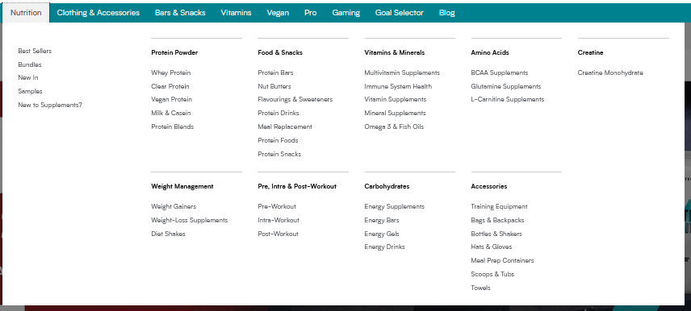
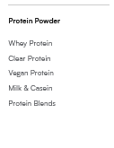
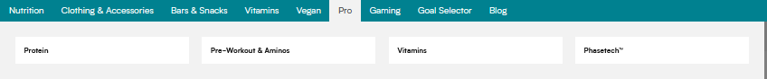
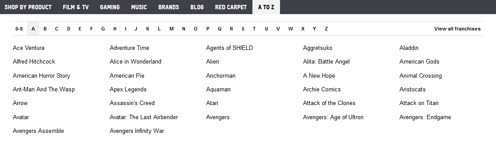
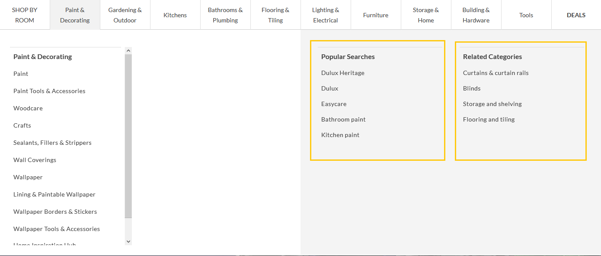

# Navigation Types

Each item in the navigation tree structure returned by the header query has a navigation type. 
This defines how it and its child items should be rendered.  Examples of how each one is rendered
can be found below:
 
## TEXT

Web, top level:

Web, second level:

Web, third level:

Mobile:

## TEXT_CARD

## IMAGE_CARD

## THUMBNAIL_CARD

## BRANDS

## DETACHED

